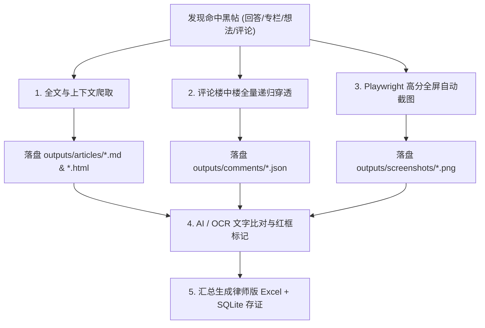

# 🛡️ 清一武道馆 · 全网舆情监控、人员穿透与法务取证系统
## 📋 业务总需求、技术架构与操作规范标准书 (Master Specification)

> **文档版本**：`v3.0 Law-Enforcement & High-Precision Production Standard`  
> **编制归属**：清一武道馆 · 数字化法务情报中心  
> **生效时间**：2026-08-25  
> **唯一事实标准**：本文档为清一武道馆反黑公关、知乎全网持续监控、律师标准版 Excel 导出、现场截图 OCR 存证与人员穿透系统的**全局唯一权威技术与业务规范**。

---

## 📑 目录导航

1. [一、 业务目标与核心诉求 (Mission & Goals)](#一-业务目标与核心诉求-mission--goals)
2. [二、 律师定版标准 Excel 证据表格式与字段规范](#二-律师定版标准-excel-证据表格式与字段规范)
3. [三、 全文下载、评论楼中楼与现场截图 OCR 存证体系](#三-全文下载评论楼中楼与现场截图-ocr-存证体系)
4. [四、 24h 持续动态搜索矩阵与多源黑子监控池](#四-24h-持续动态搜索矩阵与多源黑子监控池)
5. [五、 AI 深度判别、暗号穿透与白名单零误杀铁律](#五-ai-深度判别暗号穿透与白名单零误杀铁律)
6. [六、 云端与本地双向数据同步与导出流](#六-云端与本地双向数据同步与导出流)
7. [七、 物理文件拓扑与产物目录规范](#七-物理文件拓扑与产物目录规范)

---

## 一、 业务目标与核心诉求 (Mission & Goals)

1. **核心防护实体**：
   * **品牌与机构**：`清一武道馆`、`文人格斗`、`清一新教育`、`今日学堂`、`今日塾`；
   * **核心人物与成员**：`张健柏（清一山长）`、`明晓`、`明仪`、`明颖`、`明哲`、`刘静慧`、`郑婉芳`、`Ella` 等优秀弟子及运动员。
2. **重点打击与取证维度**：
   * **武道实战与能力抹黑**：谎称“打败泰拳没多大价值”、“无对抗实战能力”、“摆拍假武术”、“传武骗子/假大师”、“花拳绣腿”；
   * **赛事成果诋毁**：贬损国家体育总局或正规武术搏击比赛为“自娱自乐的水赛”、“花钱买金牌”；
   * **运动员生活与保障造谣**：捏造“每天高强度训练却只给极少食物”、“虐待/吊起来不给饭吃”、“精神操控/剥夺自由”；
   * **经济与刑事虚假控诉**：捏造“非法办学”、“偷税漏税”、“全能神邪教”、“传销敛财”。
3. **交付标准**：
   * 格式与《和律师商定版-收集清黑文章链接汇总表-最终.xlsx》**100% 严格对齐**；
   * 每一条证据必须包含：**原始链接、全文内容、评论楼中楼、高保真现场网页截图、AI/OCR 证据印证**。

---

## 二、 律师定版标准 Excel 证据表格式与字段规范

所有生成的证据报表，必须严格遵循以下 **8 列标准数据模型**（并按黑子个人/主体独立分 Sheet 存储）：

| 序号 | 字段名称 (Column Header) | 数据类型 | 规范说明与填充规则 |
| :---: | :--- | :---: | :--- |
| 1 | **发帖者账号名称** | String | 发帖人当时的知乎/平台昵称，如 `周河川（大王）`、`逸尘` |
| 2 | **序号** | Integer | 该发帖人在本 Sheet 内的连续编号 (1, 2, 3...) |
| 3 | **发帖日期** | String | 准确发帖时间，格式 `YYYY-MM-DD` 或 `YYYY-MM-DD HH:MM:SS` |
| 4 | **链接** | String | 该文章、回答或评论的具体可访问 URL (https://...) |
| 5 | **文章标题** | String | 问题标题、文章标题或标记为 `想法无标题` / `评论区(楼中楼)` |
| 6 | **认为该文章侵权的主要原因** | String | 律师合规侵权事实认定（明确指出其使用何种暗号代称、虚构何种武道谣言、构成何种名誉侵权） |
| 7 | **证据截图相对路径** | String | 指向 `outputs/screenshots/` 下对应高清晰图片文件 |
| 8 | **是否为武道专精攻击** | String | `是 (武道馆/实战/赛事/运动员)` 或 `否 (通用教育/其他)` |

---

## 三、 全文下载、评论楼中楼与现场截图 OCR 存证体系



1. **全文下载与评论递归**：
   * 对命中内容，不仅抓取摘要，必须通过 `/api/v4/articles/{id}` 或 `/api/v4/answers/{id}` 抓取 100% 完整 HTML 与纯文本；
   * 对评论区调用 `comment_v5` 协议，深度抓取全部根评论（Root Comments）及嵌套的所有子评论（Child Comments），保证任何一条在楼中楼反击或抹黑的言论无一遗漏。
2. **现场高保真截图与 OCR 闭环**：
   * 调用 Playwright Chromium，以 `1920x1080` 视口打开目标网页并等待 DOM 渲染完毕；
   * 自动滚动至侵权言论所在位置进行区域/全屏快照；
   * 通过 OCR 检测页面中的侵权原句，绘制红色醒目高亮边框，并将截图路径原子写入 Excel 证据清单中。

---

## 四、 24h 持续动态搜索矩阵与多源黑子监控池

云端与本地守护引擎 24 小时不间断按以下 **3 大监控源** 进行交替循环轮询：

### 1. 关键词与暗号搜索矩阵 (Keywords Matrix)
* **核心品牌实体词**：`清一武道馆`、`文人格斗`、`清一新教育`、`山长清一`、`今日学堂`、`今日塾`、`张健柏`；
* **武道负面攻击词**：`清一 假武术`、`清一 不能打`、`清一 花架子`、`清一 假大师`、`张健柏 武术`、`清一 传武`、`清一 实战`、`清一武道馆 骗局`；
* **隐蔽暗号与代称词**：`1960年代出生的老年实控人`、`老年实控人`、`鸡贼的老张`、`东方不败掌门`、`神棍大师`、`高端出海版传销`、`买家秀与卖家秀`、`自娱自乐比赛`、`打败泰拳没多大价值`、`被圈养的公主`、`土匪山长`。

### 2. 律师商定版 66 个历史黑子全网穿透池 (Lawyer 66 Attackers)
* 涵盖：`周河川（大王）`、`王秀兰（清风溪流）`、`郑婉芳（守其黑）`、`锺文（茅箴/箴茅）`、`杨永红（乐山乐水）`、`乔安娜（宁静）`、`嘲笑鸟（佳惠/龙永明）`、`王乐乐（future2035/cocucola）`、`李安心（行云流水）`、`鄢佳彦（清一山长老贼哪里跑）` 等 66 位已立案/取证主体。

### 3. 手机黑名单 64 个用户全量穿透池 (Mobile 64 Blocklist)
* 涵盖：`文成武德张`、`小王(职业打假20年)`、`宝石`、`逸尘`、`所谓高人皆为凡人`、`黄传科`、`haidao`、`旺喜47`、`江月诗`、`世间二两墨`、`大家管我叫牛哥` 等。

---

## 五、 AI 深度判别、暗号穿透与白名单零误杀铁律

### 1. 强白名单保护原则（严禁误杀）
以下主体及其言论（即使包含“传武骗子”、“打假”、“被黑”等词汇）**一律判定为己方/支持者，绝对禁止列为攻击者**：
* 🛡️ `山长 清一` (`shan-chang-qing-yi`) / `清一投资号` (`shan-chang-tou-zi-hao`)
* 🛡️ `进击的清粉` (`jin-ji-de-qing-fen`)
* 🛡️ `Ella清一公主NO.1` (`ellaqing-yi-gong-zhu-no1`)
* 🛡️ `明晓-文人格斗` (`ming-xiao-wen-ren-ge-dou`)
* 🛡️ `陆韵如 文人格斗` / `谭琛怡-文人格斗`
* 🛡️ `蔡凯琪` (`cai-kai-qi-88`) / `陈玥伊` / `陈诗宜` / `葛琮` / `司启彤` / `魏台龙`
* 🛡️ `张秉风`（写小说的/新教育公益文章）/ `长沙实之兄` / `卢嘉仪`

### 2. 辩护言论与攻击言论的语义隔离
* 若发言在评论区反驳黑粉（如“*人家免费去发财，还说人家是骗子...*”），判定为**支持者辩护言论**，自动归入白名单 Sheet；
* 若发言针对武道馆进行贬损质疑（如“*生生让我打成一个林妹妹，羞不羞？*”），判定为**真实武道攻击**，立即提取并锁定。

---

## 六、 云端与本地双向数据同步与导出流

1. **云端采集与落盘**：
   * 云端守护服务 `zhihu-monitor.service` 在 `/opt/zhihu-monitor/data/` 持续写入 SQLite 数据库 `zhihu_monitor.db`；
   * 自动下载文章全文到 `/opt/zhihu-monitor/outputs/articles/`，截图保存至 `/opt/zhihu-monitor/outputs/screenshots/`。
2. **本地随时一键同步获取**：
   * 本地客户端通过 `cloud_sync_service.py` 随时向 `http://38.76.206.7:8770/api/sync` 发起增量拉取；
   * 自动将云端捕获的所有数据库条目、Excel 报表及高清截图文件完整打包同步至本地 `C:\Users\25472\Desktop\清一武道馆\outputs\`。

---

## 七、 物理文件拓扑与产物目录规范

```text
C:\Users\25472\Desktop\清一武道馆/
├── outputs/                                              # 取证成果大目录
│   ├── excel_reports/                                    # 律师标准版 Excel 报表
│   │   ├── 清一武道馆_全网侵权文章汇总表_最终版.xlsx
│   │   └── 武道馆专项_实战与人员攻击卷宗.xlsx
│   ├── screenshots/                                      # 现场高清截图 (含红框标注)
│   │   ├── answer_98234712_full.png
│   │   └── comment_89123491_annotated.png
│   ├── articles/                                         # 全文存档 (HTML + Markdown)
│   │   ├── article_19283741.md
│   │   └── answer_98234712.html
│   └── comments/                                         # 评论楼中楼 JSON 树
│       └── comments_answer_98234712.json
│
├── data/
│   ├── blacklist_target_users.json                       # 手机 64 黑名单解析库
│   ├── lawyer_target_profiles.json                       # 律师版 66 黑子特征库
│   └── zhihu_monitor.db                                  # 本地镜像 SQLite 数据库
│
├── 清一武道馆_全网舆情监控与存证系统_总需求与技术架构规范.md # 本规范文档
└── 新教育与清一武道馆_反黑舆情语言特征图谱与攻击者风格全鉴.md # 语言特征图谱
```

---

> 🏢 **执行组织**：清一武道馆 · 数字化法务与技术中心  
> ⚖️ **法律合规声明**：本系统采集之全量数据仅用于品牌商誉维权、不正当竞争与名誉权诉讼之法务存证。
